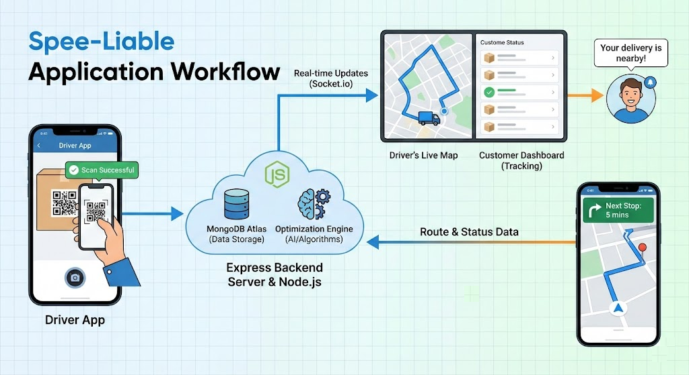
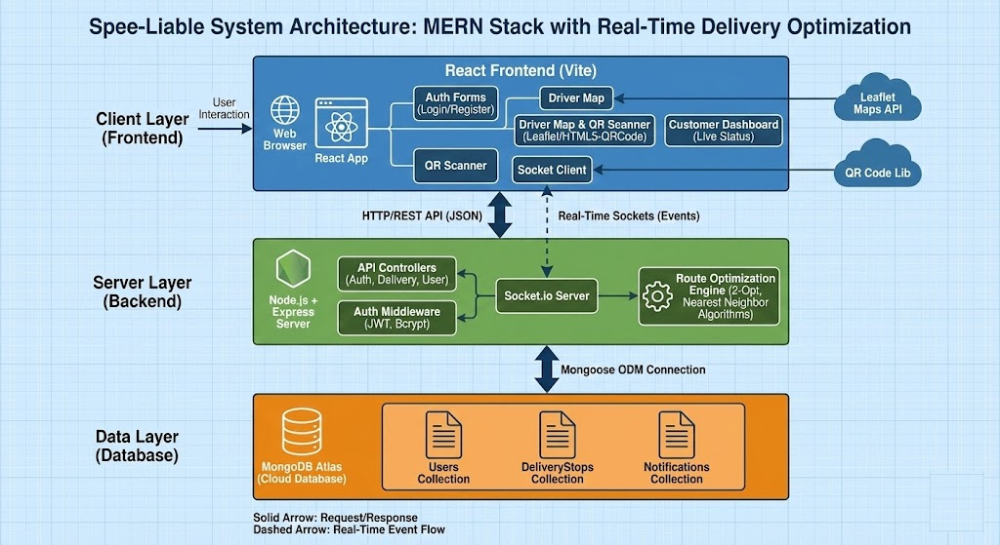

# 🚀 SpeeLiable — Smart Delivery Logistics

<p align="center">
  
</p>

**SpeeLiable** is a comprehensive MERN-stack logistics solution designed to empower delivery workforces. By combining **real-time route optimization**, **QR-based package scanning**, and **live customer interaction**, SpeeLiable automates the manual planning process and enhances the overall delivery experience for drivers and customers alike.

---

## ✨ Key Features

### 🚚 For Drivers

- **Dynamic Route Optimization**: Powered by advanced algorithms (Nearest Neighbor + 2-Opt) to find the most efficient delivery path instantly.
- **Interactive Map Interface**: Full Leaflet-based map with real-time geolocation, address searching (Nominatim API), and custom marker management.
- **QR Code Workflow**: Seamlessly scan packages using your device camera or image uploads to add them to your daily route.
- **Personal Stops Management**: Easily add personal breaks (Lunch, Fuel, etc.) into your optimized route.
- **"Ready for Delivery" Notifications**: Notify all customers in one click when you begin your delivery session.
- **Live Status Sync**: Real-time status updates (Available/Delivered) synchronized using Socket.io.

### 📦 For Customers

- **Transparent Tracking**: Dedicated dashboard to view assigned packages and their current delivery status.
- **Bi-Directional Communication**: Mark packages as _Unavailable_ if you aren't home—automatically updating the driver's optimized route in real-time.
- **Instant Alerts**: Receive system notifications when your package is scanned or marked as "Out for Delivery".

### ⚙️ For Admins

- **Unified User Management**: Control and monitor all users (Drivers, Customers, Managers) from a single interface.
- **Role-Based Access Control (RBAC)**: Fine-grained permissions for scanning, optimization, and system administration.
- **System Insights**: Comprehensive overview of delivery statistics and operational health.

---

## 🛠️ Tech Stack

### Frontend

- **React.js** (Vite)
- **Tailwind CSS** (Modern, responsive UI)
- **Leaflet & OpenStreetMap** (Mapping & Geospatial data)
- **Lucide-React** (Professional Iconography)
- **Socket.io-client** (Real-time updates)

### Backend

- **Node.js & Express**
- **MongoDB & Mongoose** (NoSQL Database)
- **Socket.io** (Real-time events)
- **JSONWebToken** (JWT Authentication)
- **Nominatim API** (Reverse Geocoding)

---

## 🏗️ Getting Started

### 1️⃣ Clone the Repository

```bash
git clone https://github.com/JAIKUMAR07/Spee-Liable.git
cd Speeliable
```

### 2️⃣ Backend Setup

```bash
cd backend
npm install
```

Create a `.env` file in the `backend` directory:

```env
PORT=5000
MONGO_URI=your_mongodb_connection_string
JWT_SECRET=your_jwt_secret
NODE_ENV=development
```

Start the server:

```bash
npm start
```

### 3️⃣ Frontend Setup

```bash
cd ../frontend
npm install
```

Start the development server:

```bash
npm run dev
```

📍 The application will be accessible at `http://localhost:5173`

---

## 📷 Screenshots

|     Home Page      |     Driver Map      |       QR Scanner        |
| :----------------: | :-----------------: | :---------------------: |
|  |  |  |

---

## 📞 Support & Socials

**Developer**: Jaikumar  
**GitHub**: [@JAIKUMAR07](https://github.com/JAIKUMAR07)  
**Project Link**: [https://github.com/JAIKUMAR07/Spee-Liable](https://github.com/JAIKUMAR07/Spee-Liable)

---

Built with ❤️ for a more efficient delivery world.
